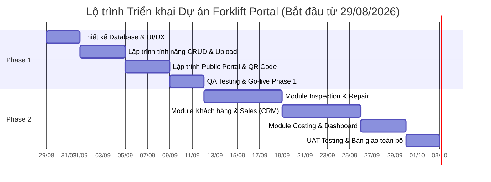

# Bảng Dự toán Chi phí & Kế hoạch Triển khai (Schedule & Budget Estimate)
**Dự án:** Hệ thống Quản lý Máy móc Cũ & Bán hàng (Forklift Portal)
*(Ghi chú: Bản dự toán đặc biệt hỗ trợ Startup & Tối ưu chi phí nhờ ứng dụng AI trong lập trình)*

---

## 1. Kế hoạch Triển khai (Timeline & Schedule)
Nhờ ứng dụng công nghệ AI, thời gian phát triển được rút ngắn tối đa (nhanh gấp 2-3 lần cách làm truyền thống). Tổng thời gian dự kiến: **~3 - 5 tuần**.

### 1.1. Phase 1: Hệ thống Cốt lõi & Cổng thông tin (Dự kiến: 1 - 2 Tuần)
Tập trung số hóa dữ liệu, xây dựng bộ khung quản lý xe nâng cơ bản và trang web Public.
- **Tuần 1:** 
  - Khởi tạo dự án, thiết kế cơ sở dữ liệu và cấu trúc UI/UX.
  - Lập trình tính năng Quản lý thông tin xe nâng (CRUD), Upload Hình ảnh.
- **Tuần 2:** 
  - Lập trình trang Public Portal (Danh mục xe, Chi tiết xe, sinh mã QR Code).
  - Kiểm thử chất lượng (QA), sửa lỗi và Deploy lên môi trường thực tế.

### 1.2. Phase 2: Nghiệp vụ Vận hành & Bán hàng (Dự kiến: 2 - 3 Tuần)
Triển khai các phân hệ sâu hơn về đánh giá (Inspection), quy trình sửa chữa (Repair) và CRM.
- **Tuần 3:** 
  - Phát triển Module Inspection (Checklist, Upload ảnh lỗi) và Module Repair.
- **Tuần 4:** 
  - Lập trình Module Quản lý Khách hàng & Sales (Inquiry, Báo giá, Chốt sale).
- **Tuần 5:** 
  - Phát triển Module Tính Chi phí & Lợi nhuận (Costing), Báo cáo thống kê (Dashboard).
  - UAT Testing toàn hệ thống, Đào tạo nhân sự và Bàn giao hoàn tất.

---

## 2. Báo giá & Dự toán (Budget Estimate)
*(Chính sách giá hỗ trợ Startup & Khách hàng thân quen. Khối lượng công việc (Man-days) đã được nén lại đáng kể nhờ AI. Đơn giá trung bình áp dụng cực kỳ ưu đãi: **1.200.000 VNĐ / Man-day**)*

### 2.1. Chi phí Phase 1 (Core & Public Portal)
| Hạng mục công việc | Mô tả ngắn | Số Man-days | Thành tiền (VNĐ) |
|---|---|:---:|---:|
| **Quản trị Dự án & BA** | Làm rõ yêu cầu, luồng dữ liệu cơ bản | 1 MD | 1.200.000 |
| **Thiết kế UI/UX** | Sử dụng thư viện UI hiện đại | 1 MD | 1.200.000 |
| **Phát triển Backend** | Database, API xe nâng, API file upload | 2 MD | 2.400.000 |
| **Phát triển Frontend** | Admin Dashboard & Trang Web khách hàng | 3 MD | 3.600.000 |
| **QA & Testing** | Kiểm thử luồng dữ liệu, test giao diện | 1 MD | 1.200.000 |
| **Tổng cộng Phase 1** | **Thời gian: 1-2 Tuần** | **8 MD** | **9.600.000 VNĐ** |

### 2.2. Chi phí Phase 2 (Operation & CRM Module)
| Hạng mục công việc | Mô tả ngắn | Số Man-days | Thành tiền (VNĐ) |
|---|---|:---:|---:|
| **Quản trị Dự án & BA** | Phân tích quy trình sâu, logic tính toán | 2 MD | 2.400.000 |
| **Thiết kế UI/UX** | Giao diện Inspection, CRM, Dashboard | 2 MD | 2.400.000 |
| **Phát triển Backend** | API Inspection, Costing, CRM | 4 MD | 4.800.000 |
| **Phát triển Frontend** | Giao diện các chức năng nghiệp vụ phức tạp | 5 MD | 6.000.000 |
| **QA & Testing** | Kiểm thử quy trình luân chuyển trạng thái | 2 MD | 2.400.000 |
| **Tổng cộng Phase 2** | **Thời gian: 2-3 Tuần** | **15 MD** | **18.000.000 VNĐ** |

### 2.3. Tổng kết Chi phí Phát triển Phần mềm
- **Tổng chi phí (Phase 1 + Phase 2):** **27.600.000 VNĐ** *(Khoảng ~1.100 USD)*
- **Ưu đãi kèm theo:** Miễn phí công cài đặt, cấu hình máy chủ và tên miền ban đầu.

---

### 2.4. Các chi phí Hạ tầng & Vận hành (Khách hàng chi trả thường niên)
- **Máy chủ & Tên miền:** Khoảng **2.500.000 VNĐ/năm** (Gói máy chủ tiết kiệm phù hợp cho hệ thống nội bộ Startup).
- **Bảo trì & Hỗ trợ kỹ thuật:** Miễn phí khắc phục lỗi phát sinh (bugs) trong **6 tháng đầu** kể từ lúc nghiệm thu Phase 1. Sau 6 tháng hỗ trợ theo từng yêu cầu hoặc ký gói bảo trì năm.
