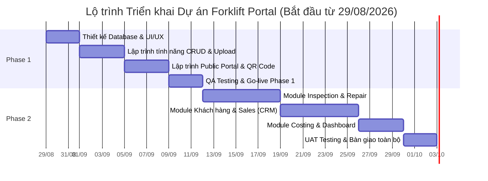

# Bảng Dự toán Chi phí & Kế hoạch Triển khai (Schedule & Budget Estimate)
**Dự án:** Hệ thống Quản lý Máy móc Cũ & Bán hàng (Forklift Portal)

---

## 1. Kế hoạch Triển khai (Timeline & Schedule)
Nhờ ứng dụng công nghệ AI, thời gian phát triển được rút ngắn tối đa (nhanh gấp 2-3 lần cách làm truyền thống). Tổng thời gian dự kiến: **~3 - 5 tuần**.

### 1.1. Phase 1: Hệ thống Cốt lõi & Cổng thông tin (Dự kiến: 1 - 2 Tuần)
Tập trung số hóa dữ liệu, xây dựng bộ khung quản lý xe nâng cơ bản và trang web Public.
- **Tuần 1:** 
  - Khởi tạo dự án, thiết kế cơ sở dữ liệu và cấu trúc UI/UX.
  - Lập trình tính năng Quản lý thông tin xe nâng (CRUD), Upload Hình ảnh.
- **Tuần 2:** 
  - Lập trình trang Public Portal (Danh mục xe, Chi tiết xe, sinh mã QR Code).
  - Kiểm thử chất lượng (QA), sửa lỗi và Deploy lên môi trường thực tế.

### 1.2. Phase 2: Nghiệp vụ Vận hành & Bán hàng (Dự kiến: 2 - 3 Tuần)
Triển khai các phân hệ sâu hơn về đánh giá (Inspection), quy trình sửa chữa (Repair) và CRM.
- **Tuần 3:** 
  - Phát triển Module Inspection (Checklist, Upload ảnh lỗi) và Module Repair.
- **Tuần 4:** 
  - Lập trình Module Quản lý Khách hàng & Sales (Inquiry, Báo giá, Chốt sale).
- **Tuần 5:** 
  - Phát triển Module Tính Chi phí & Lợi nhuận (Costing), Báo cáo thống kê (Dashboard).
  - UAT Testing toàn hệ thống, Đào tạo nhân sự và Bàn giao hoàn tất.

---

